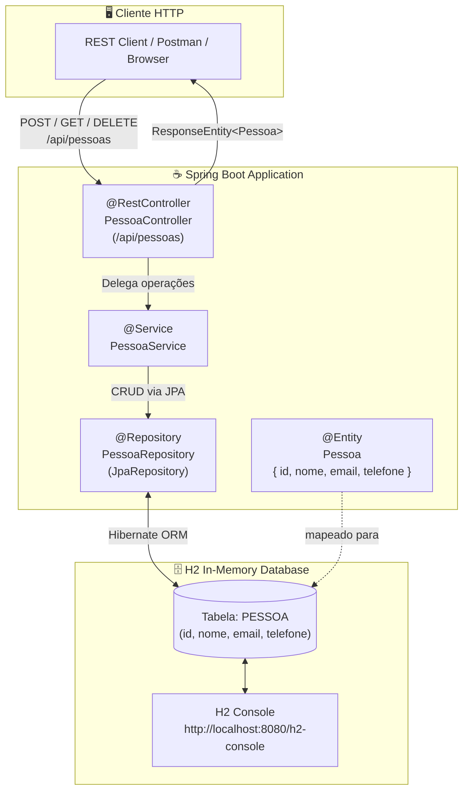
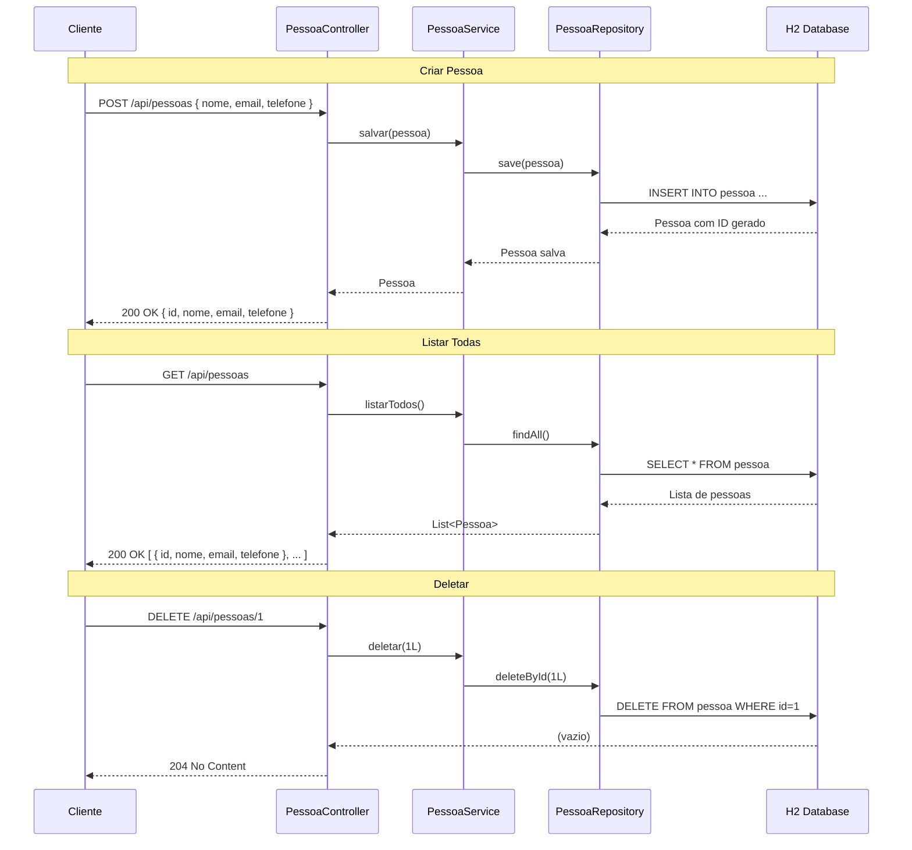
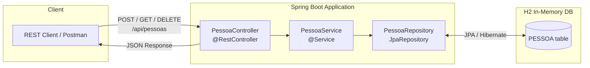

# Sistema de Gerenciamento de Pessoas — API REST com Spring Boot

[](https://www.java.com/)
[](https://spring.io/projects/spring-boot)
[](https://www.h2database.com/)
[](https://opensource.org/licenses/MIT)

---

## 🇧🇷 Português

API REST desenvolvida com **Spring Boot** para cadastro e gerenciamento de pessoas de uma organização. Utiliza Spring Data JPA com banco H2 em memória e segue a arquitetura em camadas (Controller → Service → Repository → JPA).

---

### 🏗️ Arquitetura em Camadas



---

### 🔄 Fluxo CRUD Completo



---

### 🔧 Endpoints REST

| Método | Rota                   | Descrição                | Status de Sucesso |
|--------|------------------------|--------------------------|-------------------|
| POST   | `/api/pessoas`         | Cadastrar nova pessoa    | 200 OK            |
| GET    | `/api/pessoas`         | Listar todas as pessoas  | 200 OK            |
| GET    | `/api/pessoas/{id}`    | Buscar por ID            | 200 OK / 404      |
| DELETE | `/api/pessoas/{id}`    | Deletar por ID           | 204 No Content    |

### Exemplo de Payload (POST)

```json
{
  "nome": "Gabriel Lafis",
  "email": "gabriel@email.com",
  "telefone": "11 99999-0000"
}
```

### Exemplo de Resposta

```json
{
  "id": 1,
  "nome": "Gabriel Lafis",
  "email": "gabriel@email.com",
  "telefone": "11 99999-0000"
}
```

---

### 🚀 Tecnologias

| Tecnologia         | Versão | Função                          |
|--------------------|--------|---------------------------------|
| Java               | 17+    | Linguagem principal             |
| Spring Boot        | 2.x    | Framework web                   |
| Spring Data JPA    | 2.x    | Mapeamento objeto-relacional    |
| Hibernate          | 5.x    | ORM (via Spring Data JPA)       |
| H2 Database        | 2.x    | Banco de dados em memória       |
| Lombok             | 1.18+  | Redução de boilerplate          |
| Maven              | 3.x    | Build e gestão de dependências  |

---

### 📂 Estrutura do Projeto

```
src/main/java/com/seuprojeto/apipessoas/
├── ApiPessoasApplication.java        # Classe principal
├── controller/
│   └── PessoaController.java         # Endpoints REST
├── service/
│   └── PessoaService.java            # Regras de negócio
├── repository/
│   └── PessoaRepository.java         # JpaRepository
└── model/
    └── Pessoa.java                   # Entidade JPA
```

---

### ▶️ Executando o Projeto

```bash
git clone https://github.com/galafis/Desenvolvendo-um-Sistema-de-Gerenciamento-de-Pessoas-em-API-REST-com-Spring-Boot.git
cd Desenvolvendo-um-Sistema-de-Gerenciamento-de-Pessoas-em-API-REST-com-Spring-Boot
./mvnw spring-boot:run
```

Acesse:
- **API:** `http://localhost:8080/api/pessoas`
- **H2 Console:** `http://localhost:8080/h2-console`

---

### 📝 Observações

- O banco H2 é volátil: os dados são perdidos ao reiniciar a aplicação.
- Para persistência real, substitua o H2 por PostgreSQL ou MySQL no `application.properties`.
- O projeto está pronto para deploy em plataformas como Heroku ou Railway.

---

### 📄 Licença

MIT License — sinta-se livre para usar, modificar e distribuir.

Desenvolvido para praticar conceitos de API REST com Java + Spring Boot.

---

---

## 🇬🇧 English

### People Management System — REST API with Spring Boot

REST API built with **Spring Boot** for registering and managing people in an organization. Uses Spring Data JPA with H2 in-memory database and follows a layered architecture (Controller → Service → Repository → JPA).

---

### 🏗️ Layered Architecture



---

### 📦 REST Endpoints

| Method | Route                  | Description           | Success Status |
|--------|------------------------|-----------------------|----------------|
| POST   | `/api/pessoas`         | Create a new person   | 200 OK         |
| GET    | `/api/pessoas`         | List all people       | 200 OK         |
| GET    | `/api/pessoas/{id}`    | Get person by ID      | 200 OK / 404   |
| DELETE | `/api/pessoas/{id}`    | Delete person by ID   | 204 No Content |

### Payload Example (POST)

```json
{
  "nome": "Gabriel Lafis",
  "email": "gabriel@email.com",
  "telefone": "11 99999-0000"
}
```

---

### 🚀 Getting Started

```bash
./mvnw spring-boot:run
```

- **API:** `http://localhost:8080/api/pessoas`
- **H2 Console:** `http://localhost:8080/h2-console`

---

### 🛠️ Tech Stack

| Technology      | Role                          |
|-----------------|-------------------------------|
| Java 17+        | Main language                 |
| Spring Boot     | Web framework                 |
| Spring Data JPA | ORM integration               |
| H2 Database     | In-memory database            |
| Lombok          | Boilerplate reduction         |

---

### 📄 License

MIT License — feel free to use, modify, and distribute.


---

## English

### Overview

Sistema de Gerenciamento de Pessoas — API REST com Spring Boot - A project built with Java, SQL, Spring Boot, developed by Gabriel Demetrios Lafis as part of professional portfolio and continuous learning in Data Science and Software Engineering.

### Key Features

This project demonstrates practical application of modern development concepts including clean code architecture, responsive design patterns, and industry-standard best practices. The implementation showcases real-world problem solving with production-ready code quality.

### How to Run

1. Clone the repository:
   ```bash
   git clone https://github.com/galafis/Desenvolvendo-um-Sistema-de-Gerenciamento-de-Pessoas-em-API-REST-com-Spring-Boot.git
   ```
2. Follow the setup instructions in the Portuguese section above.

### License

This project is licensed under the MIT License. See the [LICENSE](LICENSE) file for details.

---

Developed by [Gabriel Demetrios Lafis](https://github.com/galafis)
